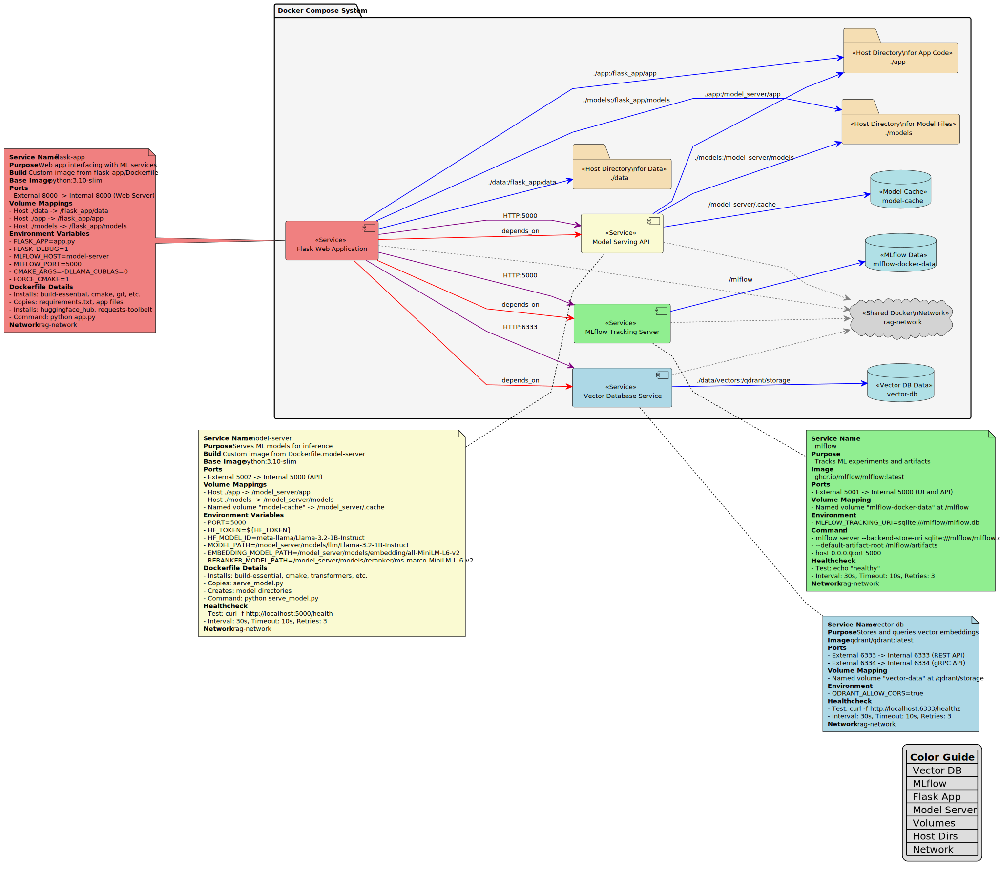

# Architecture and Design

This section describes the architecture and design of the PDF RAG System.

## System Architecture

The system is composed of several components that work together to provide the RAG functionality.

### Usecase Diagram

### Class Diagram

### Deployment Diagram

### Component Diagram

